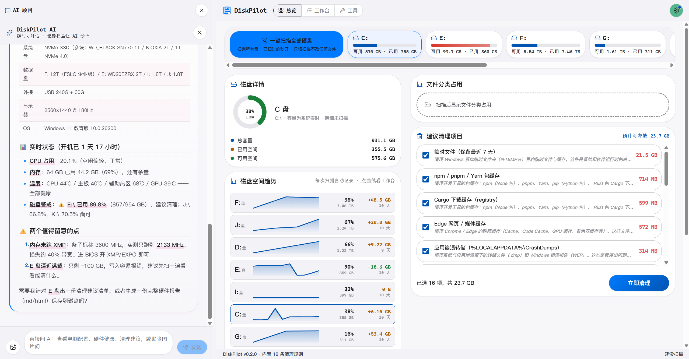
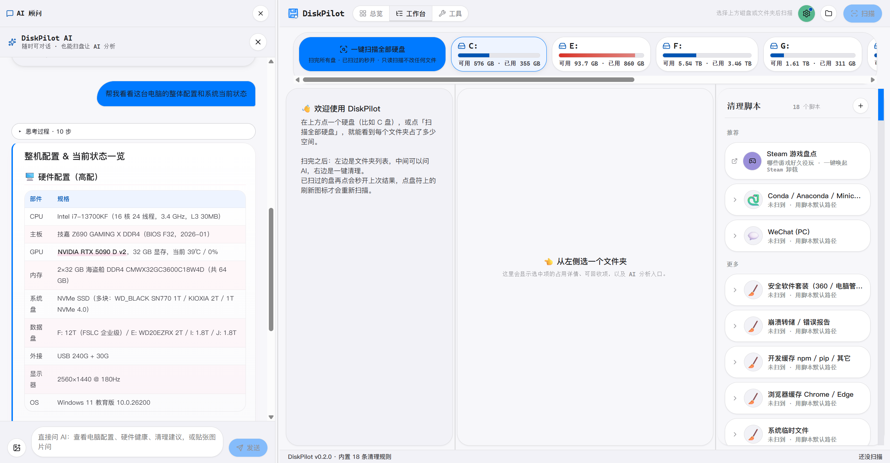
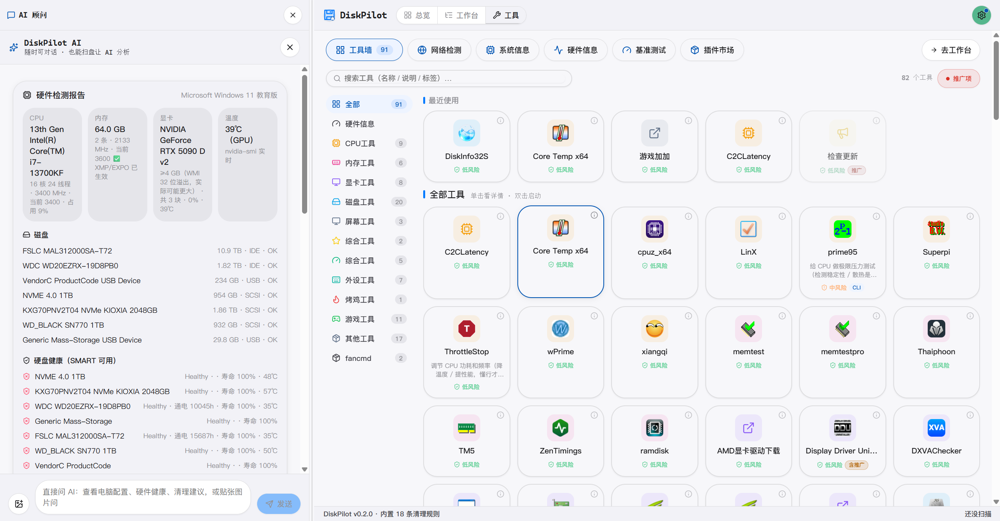

<div align="center">


# DiskPilot

**看清磁盘 · 问懂 AI · 安全删净 —— 还能让 AI 自己来操作。**

开源的磁盘分析与系统探查工具，Tauri 2 + Rust 实现。整盘秒扫定位空间去向，陌生文件夹拖给 AI 解释，已知应用按清理脚本逐项回收；内置 75 个 MCP 工具，AI agent 可以直接接入做系统巡检。

[](LICENSE)
[](https://tauri.app)
[](https://github.com/lxfebd/diskpilot/releases/tag/v0.2.1)

[下载](#下载) · [看效果](#看效果) · [功能一览](#功能一览) · [安全模型](#安全模型) · [隐私](#隐私) · [架构](#架构) · [文档](#文档) · [路线图](#路线图) · [开发](#开发) · [贡献](#贡献)

**作者：[@lxfebd](https://github.com/lxfebd) · [github.com/lxfebd/diskpilot](https://github.com/lxfebd/diskpilot)**

**简体中文 | [English](README_EN.md)**
</div>

---

## 下载

当前版本 **v0.2.1**，在 [GitHub Releases](https://github.com/lxfebd/diskpilot/releases) 直接下载：

| 平台 | 安装包 | 说明 |
|---|---|---|
| Windows 10/11 x64 | `DiskPilot_0.2.1_x64-setup.exe` | NTFS MFT 直读需要管理员权限，程序会自动请求提权 |
| macOS (Apple Silicon / Intel) | `DiskPilot_0.2.1_aarch64.dmg` / `_x64.dmg` | **未做签名公证**，首次打开需右键 → 打开；尚未在真机验证 |
| Linux | `.deb` / `.rpm` / `.AppImage` | CI 产物，**未在真实 Linux 机器上验证过**，欢迎反馈 |

所有安装包附 `.sig` 签名，内置自动更新（tauri-plugin-updater），发新版后应用内会提示升级。

也可以自行编译（约 10-15 分钟）：

```bash
git clone https://github.com/lxfebd/diskpilot diskpilot
cd diskpilot
pnpm install
pnpm tauri dev        # 开发模式（首次编译 Rust 5-15 分钟）
pnpm tauri build      # 打安装包
```

需要 **Node 20+ · pnpm 9+ · Rust stable**；Windows 另需 VS Build Tools 2022 + WebView2。

---

## 看效果

<p align="center">
  
</p>

<p align="center"><sub>总览页 · 左：AI 顾问（问"整机配置和当前状态"，它把硬件表格 + 温度 + 磁盘警戒一起答好）· 中：磁盘详情 + 各盘空间趋势曲线 · 右：建议清理项目（勾选 16 项共 23.7 GB，一键立即清理）</sub></p>

<p align="center">
  
</p>

<p align="center"><sub>工作台 · 顶部盘符卡片（一键扫描全部硬盘）· 左：文件夹树 · 中：拖文件夹给 AI 分析 · 右：Studio 已识别 18 个清理脚本（Steam 盘点、Conda、微信、安全套装……）</sub></p>

<p align="center">
  
</p>

<p align="center"><sub>工具墙 · CPU / 内存 / 显卡 / 磁盘 / 烤机 / 游戏 / 外设等 12 个分类 90+ 条目，单击看详情、双击启动，每个工具带风险等级徽标；左栏是实时硬件检测报告（SMART 寿命、温度、传感器）</sub></p>

---

## 功能一览

### 1. 秒级整盘扫描

Windows 直读 NTFS MFT（配合 USN 日志增量更新），其他平台用 jwalk 跨平台遍历兜底。整盘 C: 通常 2-5 秒扫完。结果以两种视图呈现：彩色 treemap + 单行 22px 的紧凑树视图，每个目录带占用百分比条。首页"总览"另有磁盘卡片墙、各盘空间趋势曲线与按分类聚合的占用统计。

### 2. 拖给 AI：这个文件夹是什么

不认识的文件夹，从树里拖进中间聊天框，AI 告诉你这是什么、能不能删、删了会丢什么。AI 顾问也能直接问整机状态（配置、温度、磁盘健康、清理建议）。BYOK 模式——自带 Anthropic / OpenAI / Gemini 的 API Key，或者本地跑 Ollama 完全免费。支持中/英文界面与深浅主题。

### 3. 十八份清理脚本，按 scope 逐项清

对占空间大、边界清楚的大众应用，写一份**清理脚本**（TOML 声明 scope + Rust 安全集成测试），Studio 卡片里按 scope 单独清。**现有 18 份**：

| scaffold | scope | 清理内容 |
|---|---|---|
| **微信 PC 端** | 23 | 3.x + 4.x 双兼容，清缓存/接收媒体/聊天备份；聊天 DB、收藏、朋友圈、`CustomEmotion` 在红线清单里永不触碰 |
| **Conda 环境** | 3 | 整目录回收 stale env（`conda-meta/history` mtime > 90 天），base env 灰显不可勾 |
| **浏览器缓存** | 4 | Chrome / Edge 缓存 + ServiceWorker cache |
| **开发缓存** | 5 | npm / yarn / pip / cargo 缓存 |
| **Firefox 缓存** | 3 | 网络 / 启动 / shader 缓存 |
| **Steam 着色器缓存** | 1 | ShaderCache 预编译缓存 |
| **崩溃转储** | 3 | 用户转储 + WER 报告 + 系统转储 |
| **系统临时** | 1 | `%TEMP%` |
| **Docker Buildx** | 2 | BuildKit 构建缓存 + 实例元数据；不动镜像/容器/卷 |
| **HuggingFace 缓存** | 3 | 模型 hub / 数据集 / Spaces，删后自动重建 |
| **OBS** | 2 | 崩溃转储 + 日志；不动录制文件 |
| **IDE 缓存** | 4 | VSCode / Cursor 缓存日志 + IntelliJ 系 caches/index |
| **QQ (PC)** | 5 | 9.x 缓存 / 图片 / 文件；绝不碰 `nt_data` |
| **Discord** | 5 | Electron 缓存 / GPUCache / Code Cache；登录态与凭据红线不碰 |
| **游戏引擎缓存** | 7 | Unity / UE / Godot 引擎级缓存；不进项目 `Library` / `.uproject` / `.godot` |
| **Microsoft Teams** | 11 | 1.x 经典 + 2.x 新版；MSIX 包只列目录名 |
| **Zoom** | 6 | 录制缓存 / WebRTC 媒体缓存白名单 |
| **安全软件套装** | 2 | 360 全家桶 / 电脑管家 / 火绒缓存；不动隔离区与本体 |

每份脚本都经过同一套流程：真实机器勘测目录结构 → 精准 glob → `scaffold-lint` 红线校验（CI 强制）→ 安全测试（正向断言 + 红线反向断言）→ 真机试运行验证。宁缺毋滥——早期曾有 36 份未经核验的模板脚本被全部下架，因为 glob 边界没验证过就存在误删风险。

### 4. AI agent 可操作：75 个 MCP 工具（64 只读 + 11 写）

独立的 `agent-server` crate 通过 **MCP（Model Context Protocol）stdio** 把自己接到任意 AI agent 上：

- **只读 64 个**：磁盘健康 / SMART / 大文件 / 重复文件、进程 / 服务 / 驱动 / 启动项、CPU / GPU / 内存 / 主板 / 温度 / 全量传感器快照、电池、网络连接 / 网卡明细 / WiFi（绝不读密码）、事件日志 / 防火墙 / 登录审计 / Defender 状态、回收站占用 / 环境变量 / 软件清单与 Office 激活状态、蓝屏转储分析、Steam 游戏库盘点与清理建议（只出建议不删文件）
- **写 11 个**：进程终止 / 服务控制 / 文件回收 / 软件卸载 / 压力测试 / 风扇自愈等——每一个都必须经过应用内 UI 两步确认，AI 无法绕过确认门直接改变系统状态

路径守卫从环境变量推导，拒绝盘根 / 系统目录 / 主目录根。桌面端工具墙里有独立的「AI 可操作」分区，每个工具带详情弹窗与只读/可写徽标。

### 5. 硬件中心（AIDA64 同类能力）

CPU / 内存 / 磁盘 / GPU 基准测试、CPU / GPU 压力测试（温度熔断守门）、全量传感器快照（温度、风扇、电压、功耗、频率、负载）、传感器趋势与告警、DRAM 时序 / CPUID 指令集 / 显示器信息、内存检测、系统体检报告。

### 6. 工具墙：90+ 系统工具一站集齐

CPU / 内存 / 显卡 / 磁盘 / 屏幕 / 外设 / 烤机 / 游戏等 12 个分类，CLI 白名单执行 + GUI 一键启动，每个工具带风险等级徽标，配四级权限模型（最高危一档永久禁止）。

### 7. 插件市场：内置工具可插件化，社区注册表在线扩展

工具墙里的 CLI 工具可一键"插件化"（写入 `tool.plugin.json`，随时摘除），同一套安全模型继续生效。社区注册表支持配置索引 URL：签名强制校验（Ed25519）、一键下载 / 更新 / 回滚 / 卸载（卸载进回收站可恢复），未配置索引时内置 2 个官方占位插件兜底展示。官方索引仓库后建，现阶段以 URL 配置化框架落地。

---

## 安全模型

删错一个文件比省下一百 GB 严重得多。DiskPilot 的删除路径上有层层闸门：

1. **默认进系统回收站**，不直接抹除，可恢复
2. **操作日志**：每一次删除写 `~/.diskpilot/undo.jsonl`，"最近清理"面板支持一键撤销（回收站 / 隔离区两条找回路径），可选 7 天隔离区（quarantine）模式
3. **清理脚本红线**：`scaffold-lint` 在 CI 上强制校验每份 TOML 的 glob 不许命中用户数据目录；每份脚本配套的安全测试包含**红线反向断言**（例如微信脚本必须断言聊天 DB 永不被命中），没有测试的脚本进不了仓库
4. **写操作确认门**：11 个 MCP 写工具在协议层要求确认参数，桌面 UI 两步确认后才下发；agent 模式下 AI 拿到工具也越不过这道门
5. **路径守卫**：拒绝盘根、系统目录、用户主目录根这类"删了就完蛋"的路径

原则就一句话：**宁可错放 1000GB，不可错删一个文件。**

---

## 隐私

- 拖给 AI 的只有**目录元数据**：路径名、大小、文件数、扩展名占比、最多 20 条样本路径——**永远不读文件内容**
- BYOK：API Key 存在你本机，请求直接从你的机器发给模型服务商
- 扫描数据、清理历史、撤销日志全部在本机 `~/.diskpilot/`，没有任何云端上传
- 工具层枚举目录时只用目录列表，不读取聊天数据库、媒体文件、凭据文件

---

## 架构

```
┌────────────────────┐     ┌─────────────────────┐
│   React + Tauri    │────>│  Rust workspace     │
│   (前端 UI)         │<────│  (7 crates)         │
└────────────────────┘     └──────────┬──────────┘
                                      │
   ┌───────────┬───────────┬──────────────────────┬───────────┬────────────┬───────────┐
   │           │           │          │            │           │            │           │
┌──▼─────┐ ┌───▼─────┐ ┌──▼─────┐ ┌──▼──────┐ ┌───▼───────┐ ┌─▼────────┐ ┌─▼──────────┐
│scanner │ │scaffold │ │executor│ │scaffold-│ │steam-     │ │toolbelt  │ │agent-server│
│NTFS MFT│ │TOML 加载│ │回收站/ │ │lint CI  │ │insp.      │ │工具墙    │ │75 个 MCP   │
│+USN+walk││+globset │ │隔离区  │ │红线校验 │ │Steam 盘点 │ │90+ 集成  │ │工具(64+11) │
└────────┘ └─────────┘ └────────┘ └─────────┘ └───────────┘ └──────────┘ └────────────┘
```

| 层 | 技术栈 |
|---|---|
| 前端 | React 18 + TypeScript + Tauri 2 · Zustand · i18n（中/英）· 深浅主题 |
| 后端 | Rust workspace（7 crates）+ Tauri IPC |
| 扫描 | Windows：NTFS MFT 直读 + USN 日志增量 / 跨平台：jwalk |
| AI | BYOK · Anthropic / OpenAI / Gemini / Ollama 四协议 |
| agent 接口 | MCP stdio（`agent-server` 独立进程，可被任意外部 agent 挂接） |
| 数据 | 用户本机 `~/.diskpilot/`（undo.jsonl + quarantine/）· 不上云 |

---

## 文档

- [docs/](docs/README.md) — 架构详解、使用说明书、清理脚本编写指南
- [website/index.html](website/index.html) — 项目宣传站（本地浏览器直接打开即可预览）

---

## 路线图

已完成：

- [x] 整盘秒扫 + treemap / 树视图 + 总览页（磁盘卡片墙 / 空间趋势 / 分类占用）
- [x] 拖文件夹给 AI 解释 + AI 顾问整机问答（BYOK 四协议）
- [x] 18 份清理脚本 + 红线校验 + 安全测试流水线
- [x] 回收站 / undo.jsonl / 隔离区 / 一键撤销
- [x] 75 个 MCP 工具的 AI agent 操作层（写操作确认门）
- [x] 硬件中心（基准 / 压测 / 传感器 / 体检报告）+ 工具墙 90+ 工具集成
- [x] Steam 游戏库只读盘点 + 着色器缓存清理
- [x] 性能专项：扫描链路内存与渲染优化（克隆裁剪 / 选中节点引用 / 虚拟滚动 / 批量检测 / 黑名单目录）
- [x] v0.2.1 发布管线：CI 构建 + 签名 + 应用内自动更新

进行中 / 计划：

- [ ] 扫描结果落盘持久化（重启不丢扫描数据）
- [ ] 低配机器优化专项
- [ ] macOS 签名公证 + Linux 真机验证
- [ ] 用户自制清理脚本（脚手架 CLI + 社区分享渠道）

---

## 开发

```bash
git clone https://github.com/lxfebd/diskpilot diskpilot
cd diskpilot
pnpm install
pnpm tauri dev            # 桌面 app（首次编译 Rust 依赖 5-15 分钟）
pnpm -C apps/desktop dev  # 仅前端，浏览器调试
cargo test --workspace    # Rust 全工作空间测试（Windows 上 MFT 相关用例需管理员权限终端）
pnpm -C apps/desktop exec vitest run   # 前端测试
```

目录速览：`apps/desktop`（Tauri 前端 + 后端）、`crates/`（7 个 Rust crate）、`scaffolds/`（18 份清理脚本 TOML）。

## 贡献

最有价值的贡献是**为新的应用写清理脚本**。每份脚本要求：

1. 在真实机器上勘测该应用的目录结构，找出缓存与用户数据的边界
2. 照 [`scaffolds/_templates/`](scaffolds/_templates/) 的模板写 TOML
3. 照 [`crates/scaffold/tests/_templates/`](crates/scaffold/tests/_templates/) 写安全测试——**正向断言 + 红线反向断言**，CI 必跑，没测试不收
4. 本地试运行验证后再提 PR

其他方向同样欢迎：修复扫描/性能问题、补翻译、在真实 Linux/macOS 机器上验证并回报问题。

---

## 致谢

- **灵感与思路参考**：[WizTree](https://diskanalyzer.com)（NTFS MFT 直读）、[SpaceSniffer](http://www.uderzo.it/main_products/space_sniffer/)（treemap 可视化）、[CleanMyWechat](https://github.com/blackboxo/CleanMyWechat)（微信清理边界）、[SquirrelDisk](https://github.com/adileo/squirreldisk)（Tauri + Rust 形态）
- **依赖**：[Tauri](https://tauri.app) · [`d3-hierarchy`](https://github.com/d3/d3-hierarchy) · [`jwalk`](https://github.com/jessegrosjean/jwalk) · [`ntfs`](https://github.com/ColinFinck/ntfs) · [`globset`](https://github.com/BurntSushi/ripgrep/tree/master/crates/globset) · [`trash-rs`](https://github.com/Byron/trash-rs) · [react-markdown](https://github.com/remarkjs/react-markdown) · [rmcp](https://github.com/modelcontextprotocol/rust-sdk)

---

## License

[MIT](LICENSE) · 欢迎 fork、商用、闭源衍生。改清理脚本时请同步维护它的安全测试——红线断言是防止误删用户数据的最后一道闸。
