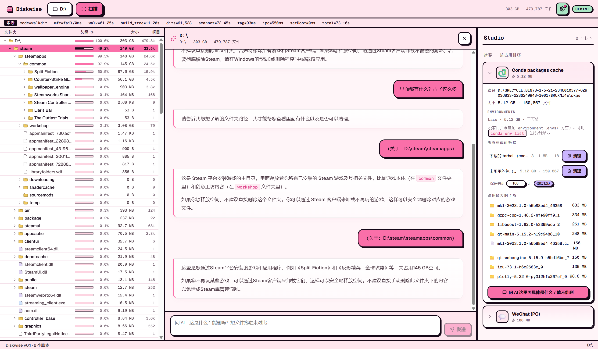
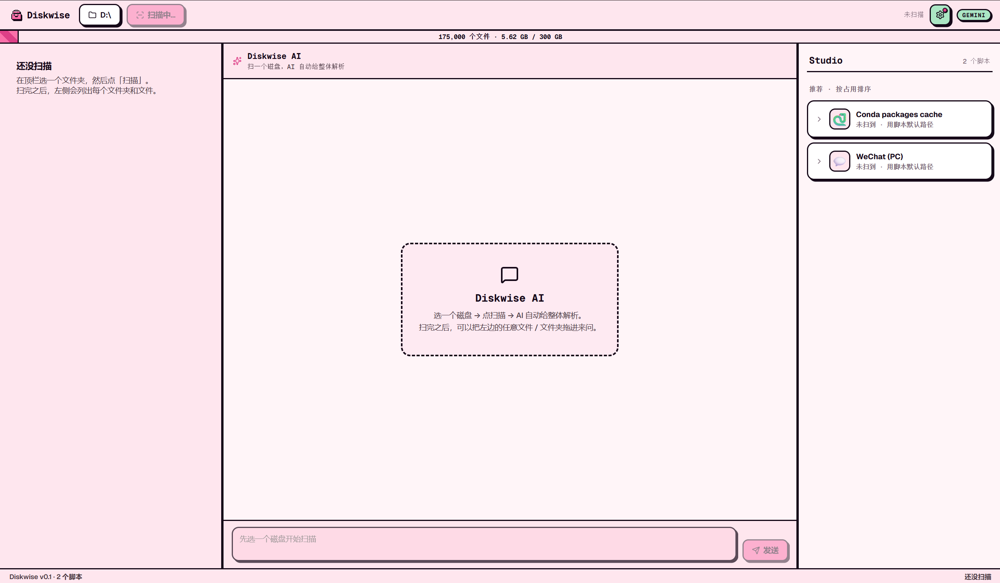

<div align="center">


# DiskPilot

**扫盘 · 看懂 · 一条一条删干净。**

开源磁盘清理工具。秒扫整盘看空间分配，把不认识的文件夹拖给 AI 让它告诉你这是什么、能不能删、删了会丢什么，再按 scope 逐项放心删——默认进回收站，永远不读你的文件内容。

[](LICENSE)
[](https://tauri.app)
[](#获取)

[获取](#获取) · [看效果](#看效果) · [三件事](#三件事) · [怎么用](#怎么用) · [架构](#架构) · [路线图](#路线图) · [帮帮孩子吧](#帮帮孩子吧) · [致谢](#致谢)

**简体中文 | [English](README_EN.md)**
</div>

---

## 获取

**目前还没有发布安装包**（代码仓库与 release 通道还没上线）。想试用的可以自己编译，约 10-15 分钟：

```bash
git clone https://github.com/lxfebd/diskpilot diskpilot
cd diskpilot
pnpm install
pnpm tauri dev        # 开发模式（首次编译 Rust 5-15 分钟）
pnpm tauri build      # 打出安装包（NSIS .exe + MSI，产物在 src-tauri/target/release/bundle/）
```

需要 **Node 20+ · pnpm 9+ · Rust stable · VS Build Tools 2022 + WebView2**（Windows 10/11 x64）。

> 安装包发布后：SmartScreen 首次拦截点"更多信息"→"仍要运行"；NTFS MFT 直读需要管理员权限，安装包带 manifest 自动 UAC。
>
> macOS / Linux 暂不提供预编译版（macOS 还没有签名证书，Linux 也没在真实机器上验过），同样可以用 `pnpm tauri build` 自行编译。

---

## 看效果

<p align="center">
  
</p>

<p align="center"><sub>实际使用 · 左：D:\ 树状视图（每行带占用百分比条）· 中：拖 <code>D:\steam\steamapps</code> 给 AI，AI 用 markdown 回答这是什么、能不能删 · 右：Studio 卡片展开 Conda packages cache（5.12 GB · 150,867 文件）</sub></p>

<p align="center">
  
</p>

<p align="center"><sub>初始空态 · 顶部"选择磁盘或文件夹"→ 点扫描后才会有内容；右侧 Studio 已经认出 WeChat / Conda 两个脚本（脚本默认路径还没扫到，所以是"未扫到"状态）</sub></p>

---

## 三件事

DiskPilot 只做三件事：简单、简单、还是TMD简单

### 1. 把磁盘空间分配看清楚

Windows 上直读 NTFS Master File Table（其他平台用 jwalk 跨平台 walker 兜底），整盘 C: **2–5 秒**扫完。出彩色 treemap + 单行 22px 高的树视图——一眼看到 `D:\xwechat_files` 占了 80GB，`C:\Users\<你>\AppData\Local\Docker` 占了 50GB。

### 2. 拖拽到中间 AI 分析"这个文件夹是什么"

不认识的文件夹？把它从左边树或右边路径**拖进中间聊天框**，AI 解释这是什么、能不能删、删了会丢什么。BYOK——你提供 Anthropic / OpenAI / Gemini 的 Key，或本地跑 Ollama 完全免费。

**DiskPilot 只发目录元数据**给 AI（路径名、大小、文件数、扩展名占比、最多 20 条样本路径）—— **永远不读文件内容**。

### 3. 已知应用走专属清理脚本

某些应用大众化、占空间大、清理边界清楚——给它写一份**清理脚本**（一份 TOML + 一份 Rust 集成测试），用户在 Studio 卡片里直接按 scope 单独清。**目前十八份**：

| scaffold | scope 数 | 清理内容 |
|---|---|---|
| **微信 PC 端** | 23 | 3.x + 4.x 双兼容，清缓存/接收媒体/聊天备份，永不动聊天 DB / 收藏 / 朋友圈 / `CustomEmotion` |
| **Conda 环境** | 3 | 整目录回收 stale env（`conda-meta/history` mtime > 90 天），base env 灰显不可勾 |
| **浏览器缓存** | 4 | Chrome / Edge 缓存 + ServiceWorker cache |
| **开发缓存** | 5 | npm / yarn / pip / cargo 缓存 |
| **Firefox 缓存** | 3 | 网络缓存 / 启动缓存 / shader 缓存 |
| **Steam 着色器缓存** | 1 | Steam ShaderCache 预编译缓存 |
| **崩溃转储** | 3 | 用户级崩溃转储 + WER 报告 + 系统级崩溃转储 |
| **系统临时** | 1 | `%TEMP%` 临时文件 |
| **Docker Buildx 构建缓存** | 2 | BuildKit 构建缓存（`~/.cache/buildkit`）+ Docker Buildx 实例元数据；永不动镜像/容器/卷 |
| **HuggingFace 缓存** | 3 | 模型 hub / 数据集 / Spaces 缓存（`~/.cache/huggingface`），删后自动重建 |
| **OBS 录像缓存** | 2 | OBS 崩溃转储 + 日志文件（`%APPDATA%/obs-studio`），不影响录制文件 |
| **IDE 缓存** | 4 | VSCode / Cursor 的 Cache/GPUCache/CachedData/logs + IntelliJ 系 caches/index |
| **QQ (PC)** | 5 | 9.x 经典版缓存 / 图片 / 文件，绝不碰 `nt_data`（聊天消息目录在红线清单） |
| **Discord** | 5 | Electron 缓存 / GPUCache / Code Cache，登录态、凭据文件红线不碰 |
| **游戏引擎缓存** | 7 | Unity / UE / Godot 引擎级缓存（ShaderCache、DDC、Intermediate）；绝不进项目 `Library` / `.uproject` / `.godot` |
| **Microsoft Teams** | 11 | 1.x 经典版 7 项 + 2.x 新版 4 项；MSIX 包只列目录名 |
| **Zoom** | 6 | 录制缓存 / WebRTC 媒体缓存白名单；录制文件只 detect 不 scope |
| **安全软件套装** | 2 | 360 全家桶（浏览器 / 安全卫士）/ 电脑管家 / 火绒缓存；绝不动隔离区与本体二进制 |

**为什么砍掉之前那 36 个 legacy scaffold**：因为没人验过 glob 边界，存在误删风险（典型例子：旧版 `node-modules` 把 Cursor / VSCode / 游戏内嵌的 node_modules 也命中了）。每个新增脚本都走同一套 14-phase 工作流：实地勘测 → 精准 glob → scaffold-lint 红线检查 → safety 集成测试（正向 + 红线反向）→ 真机 dry-run 验证。

### 4. AI 可操作工具集（agent-server，75 个 MCP 工具 = 64 只读 + 11 写）

独立的 `agent-server` crate 通过 **MCP（Model Context Protocol）stdio** 给 AI 提供 64 个**只读**（L0 级）查询能力与 11 个**写操作**（需用户确认）：磁盘健康 / 大文件 / 重复文件、进程与 CPU / 服务与驱动 / 开机启动项、CPU / GPU / 内存 / 主板 / 温度 / **全量传感器快照（AIDA64 同类，CPU/GPU/主板温度、风扇转速、电压、功耗、频率、负载）** / 电池 / SMART、网络连接 / **网卡明细（MAC/子网掩码/网关/DNS）** / WiFi（绝不读密码）、事件日志 / 防火墙规则 / 登录审计 / **Defender 状态 / 用户账户**、回收站占用 / 环境变量 / **软件与 Office 激活状态**，外加 AIDA64 复刻基准（CPU / 内存 / 磁盘 / GPU）、压力测试（CPU / GPU 温度熔断守门）、系统体检报告、传感器趋势 / 告警、DRAM 时序 / CPUID 指令集 / 显示器信息、蓝屏转储分析、内存检测（MemTest86 简化版）、Steam 游戏库盘点与按 scaffold 分类的清理建议（只出建议不删文件）。路径守卫从环境变量推导，拒绝盘根 / 系统目录 / 主目录根。工具墙里有独立的「AI 可操作」分区，每个工具带详情弹窗（参数说明 + 只读徽标）。

所有删除默认进**系统回收站**，可恢复。每一次操作写 `~/.diskpilot/undo.jsonl`，可选 7 天 quarantine。

---

## 怎么用

1. **拿安装包**[（上面）](#获取)——发布通道上线前先用 `pnpm tauri build` 自编译，双击安装，桌面出现 DiskPilot 图标
2. **打开 → 右上角 ⚙ 配 AI**——填LLM的API Key
3. **顶部"选择磁盘或文件夹"→ 点扫描**——2-5 秒后看到 treemap + 树
4. **遇到陌生大文件夹**——拖到中间聊天框问 AI；或者右侧 Studio 已经认出了的（微信、conda）直接看清理面板
5. **删除前**：已支持十八份清理脚本（微信、Conda、浏览器、开发缓存、Firefox、Steam 着色器、崩溃转储、系统临时、Docker Buildx、HuggingFace、OBS、IDE 缓存、QQ、Discord、游戏引擎、Teams、Zoom、安全软件套装），按 scope 自动无风险清理。其他的，自行清理，毕竟宁可错放 1000GB，不可错删一个文件。

---

## 架构

> 想看人话解释（不堆术语，普通用户也能看懂）：📖 **[docs/ARCHITECTURE.md](docs/ARCHITECTURE.md)**

> **文档体系**（仓库根）：[AGENTS.md](AGENTS.md)（AI/新开发者入口）· [project-overview.md](project-overview.md)（整体说明）· [architecture.md](architecture.md)（架构与数据流）· [DESIGN.md](DESIGN.md)（视觉规则）· [TODO.md](TODO.md)（任务与进度）· [development.md](development.md)（开发命令与回归）· [user-guide.md](user-guide.md)（使用指南）· [component-api.md](component-api.md)（组件 API）

```
┌────────────────────┐     ┌─────────────────────┐
│   React + Tauri    │────>│  Rust workspace     │
│   (前端 UI)         │<────│  (7 crates)         │
└────────────────────┘     └──────────┬──────────┘
                                      │
   ┌───────────┬───────────┬──────────┼────────────┬───────────┬────────────┬───────────┐
   │           │           │          │            │           │            │           │
┌──▼─────┐ ┌───▼─────┐ ┌──▼─────┐ ┌──▼──────┐ ┌───▼───────┐ ┌─▼────────┐ ┌─▼──────────┐
│scanner │ │scaffold │ │executor│ │scaffold-│ │steam-     │ │toolbelt  │ │agent-server│
│NTFS MFT│ │TOML 加载│ │Recycle/│ │lint CI  │ │insp. Steam│ │图吧工具箱 │ │75 个 MCP   │
│+ jwalk │ │+ globset│ │Quarant.│ │红线校验 │ │盘点(ACF)  │ │集成       │ │工具(64+11) │
└────────┘ └─────────┘ └────────┘ └─────────┘ └───────────┘ └──────────┘ └────────────┘
```

| 层 | 技术栈 |
|---|---|
| 前端 | React 18 + TypeScript + Tauri 2 + react-markdown |
| 后端 | Rust workspace（7 crates）+ Tauri IPC |
| 扫描器 | Windows: NTFS MFT 直读（`ntfs` crate）/ 跨平台: `jwalk` |
| AI | BYOK · Anthropic · OpenAI · Gemini · Ollama 四协议 |
| 数据 | 用户本机 `~/.diskpilot/`（undo.jsonl + quarantine/）· 不上云 |

---

## 路线图

- [x] 整盘秒扫，看到每个文件夹占多少
- [x] 拖任意文件夹给 AI 问"这是什么、能不能删"
- [x] 十八份清理脚本：微信、Conda、浏览器缓存、开发缓存、Firefox、Steam 着色器、崩溃转储、系统临时、Docker Buildx、HuggingFace、OBS、IDE 缓存、QQ、Discord、游戏引擎缓存、Teams、Zoom、安全软件套装
- [x] "撤销"按钮：删错了能从回收站 / 隔离区一键找回（`~/.diskpilot/undo.jsonl` + 前端"最近清理"面板）
- [x] Steam 着色器缓存清理（SteamInspector 只读盘点 + shader scaffold 清理）
- [x] 首页"磁盘资产总览"改版：磁盘卡片墙 + 按分类（cache / media / backup / envs）的占用卡片墙 + Top N 大目录，点击卡片定位回工作台对应节点
- [x] 性能专项：scanner 端批量 scaffold 检测（消灭前端逐节点 IPC）、build_tree 复用扫描一趟数据、每目录 top-K 文件内存裁剪、系统目录黑名单（WinSxS / Installer / $Recycle.Bin / hiberfil.sys 等）、scanner 累加并行化、扫描取消通道、进度按文件数+时间双阈值节流、TreeView 虚拟滚动、MFT fallback 提示
- [x] 工具墙：图吧工具箱 30 工具集成（CLI 白名单执行 + GUI 启动）+ 四级权限（L3 永禁）+ 硬件中心（AIDA64 复刻：基准/压测/报告/趋势/告警）
- [ ] 出 macOS / Linux 的预编译版（要先解决签名 + 真机验证）
- [ ] 让用户能自己写、自己分享清理脚本（`scaffold new` CLI + 社区仓库）

---

## 帮帮孩子吧

最有价值的贡献是**写新的清理脚本**。每加一个 App 支持就是一份 PR（等公开仓库上线后开放提 PR；现在可以在本地跑完整流程自验）：

1. 在 [`docs/scaffold-requirements/`](docs/scaffold-requirements/) 写需求文档（红线清单：聊天 DB？账号 key？用户收藏？）
2. 在你机器上跑这个 App，用 `Glob` 列出真实目录结构，找出 cache vs 用户数据的边界
3. 抄 [`scaffolds/_templates/scaffold.toml`](scaffolds/_templates/scaffold.toml) 写 TOML
4. 抄 [`crates/scaffold/tests/_templates/scaffold_safety.rs`](crates/scaffold/tests/_templates/scaffold_safety.rs) 写 safety test（**正向断言 + 红线断言**，CI 必跑，没测试不收）
5. `pnpm tauri dev` 目视确认卡片渲染
6. 提 PR（公开仓库上线后），模板会带 14 项 checklist

[Claude Code](https://claude.com/claude-code) 用户可以直接在仓库根目录敲 `/add-scaffold <id>`，一键启动 14-phase 工作流。

详细流程：[development.md](development.md) 的「新增/修改 scaffold」章节。

### 开发

```bash
git clone https://github.com/lxfebd/diskpilot diskpilot
cd diskpilot
pnpm install
pnpm tauri dev            # 桌面 app（首次会编译 Rust 依赖，5-15 分钟）
pnpm -C apps/desktop dev  # 仅前端，浏览器调试，mock 后端
cargo test --workspace    # 全工作空间测试
```

需要 **Node 20+ · pnpm 9+ · Rust stable · Tauri 前置依赖**（Windows 上是 VS Build Tools 2022 + WebView2）。

---

## 致谢

- **灵感来源**
  - [WizTree](https://diskanalyzer.com) —— NTFS MFT 直读思路与速度标杆
  - [SpaceSniffer](http://www.uderzo.it/main_products/space_sniffer/) —— treemap 可视化先驱
  - [CleanMyWechat](https://github.com/blackboxo/CleanMyWechat) —— 微信清理脚本范本，messaging 需求文档参考它
  - [SquirrelDisk](https://github.com/adileo/squirreldisk) —— Tauri + Rust 实现参考
- **依赖巨人的肩膀**：[Tauri](https://tauri.app) · [`d3-hierarchy`](https://github.com/d3/d3-hierarchy) · [`jwalk`](https://github.com/jessegrosjean/jwalk) · [`ntfs`](https://github.com/ColinFinck/ntfs) · [`globset`](https://github.com/BurntSushi/ripgrep/tree/master/crates/globset) · [`trash-rs`](https://github.com/Byron/trash-rs) · [react-markdown](https://github.com/remarkjs/react-markdown)
- **协作**：[Claude Code](https://claude.com/claude-code) · [@jtlyu](https://github.com/jtlyu)（性能优化 + WeChat 4.x 重写 + scaffold harness 工作流基建）
---

## License

[MIT](LICENSE) · 欢迎 fork、商用、闭源衍生。改 scaffold 时记得同步改它的 safety test——红线断言是防止误删用户数据的最后一道闸。
